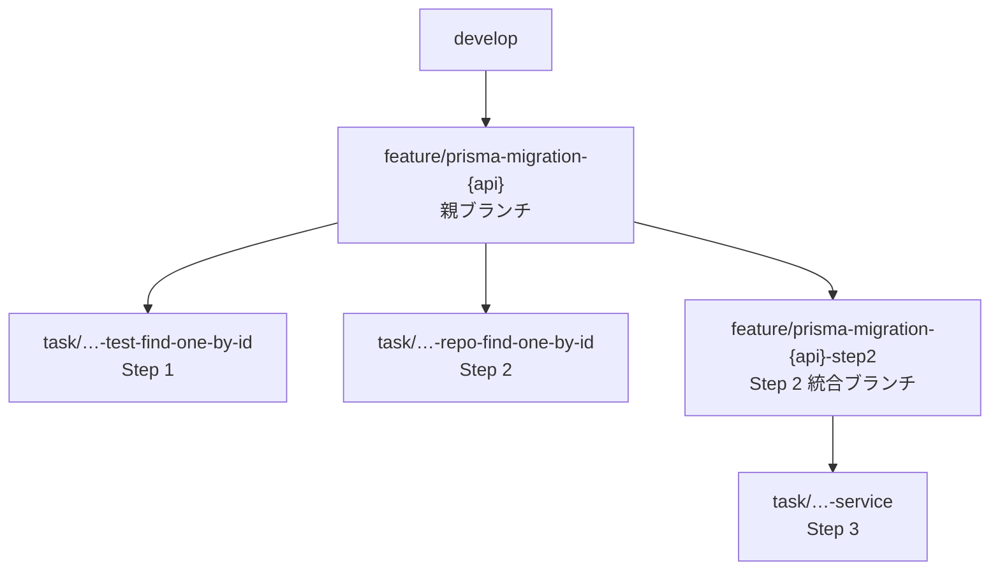

<!--
アスエネの ASUENE SC 開発チームで、NestJS 製サーバーの ORM を
TypeORM から Prisma へ段階的に移行している話をします。
テーマは「移行のやり方」ではなく「移行を任せられる形に設計した話」です。
-->

---
layout: define
kicker: 前提
term: 何をやっているか
definition: NestJS 製サーバーの ORM を、TypeORM から Prisma へ <span class="accent2">段階的に移行</span>中。
points:
  - Repository レイヤーを 1 メソッドずつ Prisma 化
  - 通常開発（develop）は止めない
  - 数十メソッド規模の単調な作業
---

<!--
規模感が大事です。数十メソッド。人間が根性でやる量ではないし、
かといって一括置換で済むほど単純でもない。
-->

---
layout: statement
kicker: 課題
title: 通常開発を止めずに、ORM をリプレースしたい。
---

---
layout: panels
kicker: 解いた方法
title: 効果的だった <span class="accent2">3 つの戦略</span>
panels:
  - icon: "lucide:git-compare"
    title: ハイブリッドテスト
    items:
      - 移行前後でテスト観点が同一であることを diff で証明
  - icon: "lucide:git-pull-request"
    title: 1 メソッド = 1 ブランチ = 1 PR
    items:
      - 粒度ルールを明文化してエージェントに守らせる
  - icon: "lucide:git-branch"
    title: 親ブランチ + 統合ブランチ
    items:
      - レビュー待ちでもエージェントが進行できる
---

<!--
この 3 つが今日の話の骨格です。順番に見ていきます。
-->

---
layout: agenda
title: 話すこと
items:
  - { topic: なぜ一気に書き換えられないのか, desc: 3 つの制約 }
  - { topic: 移行の 3 ステップ, desc: "Step 1 テスト / Step 2 Repository / Step 3 Service" }
  - { topic: AI に任せるための仕組み, desc: "Agent Skills とブランチ戦略" }
  - { topic: 詰まったところ, desc: 論理削除とリレーション }
  - { topic: 最大の学び, desc: AI に任せられる手順とは }
---

---
layout: section
index: "01"
kicker: Part one
title: なぜ「一気に書き換え」ができないのか
---

---
layout: default
kicker: 制約 1
title: develop ブランチが<span class="accent2">動き続けている</span>
ghost: "01"
---

- 移行は短期では終わらない。一方で通常開発は継続する
- 大規模な移行ブランチは、develop との差分が**指数関数的に増加**
- コンフリクト解消コストが膨大に

<Callout icon="lucide:check">
**対策** — API 単位でブランチを切り、API 単位でリリース。細粒度のリリースで通常開発サイクルの阻害を回避。
</Callout>

<!--
長生きするブランチは負債です。差分が増えるほどマージが怖くなり、
怖くなるほどマージが遅れ、さらに差分が増える。
-->

---
layout: default
kicker: 制約 2
title: 大きすぎる PR は<span class="accent2">マージできない</span>
ghost: "02"
---

Repository 1 クラス分の移行 PR は、こうなります。

<Stat value="+800" unit=" / −600" label="1 クラス分の移行 PR の行数" tone="bad" icon="lucide:file-diff" />

- どの Prisma メソッドがどの TypeORM メソッドに対応するかを、**レビュアーが自力で復元**する必要がある
- 機械的な書き換えに紛れた挙動変更が埋もれる

結果は「形式的な Approve」か「後回し」。どちらも悪い結果です。

<!--
+800 −600 の PR を渡された側の気持ちを想像してください。
読めないので、通すか止めるかの二択になる。
-->

---
layout: statement
kicker: 対策 2
title: 1 メソッド = 1 PR を、絶対ルールにする。
---

---
layout: default
kicker: 制約 3
title: 挙動を変えていないことを<span class="accent2">保証</span>する
ghost: "03"
---

ORM を変えると「一見動いているが細かな挙動が変わる」ケースが起きます。

<Callout tone="warn" icon="lucide:triangle-alert">
`findOne` は **null を返す**のか、**エラーを throw する**のか。ORM ごとに違う。
</Callout>

- テストが通るだけでは足りない
- **移行前後でテスト観点そのものが変わらないこと**を担保したい

<!--
ここが一番厄介です。テストがグリーンでも、
テスト自体が書き換わっていたら何も証明していない。
-->

---
layout: section
index: "02"
kicker: Part two
title: 移行の 3 ステップ
---

---
layout: compare
kicker: 全体像
title: 3 ステップと、その PR 粒度
columns: [ステップ, やること, PR 粒度]
rows:
  - { metric: Step 1, before: "TypeORM Repository のテストをハイブリッド Test 構成で作成", after: "1 メソッド = 1 PR" }
  - { metric: Step 2, before: "Prisma 版 Repository を作成し、テストの import 先を差し替え", after: "1 メソッド = 1 PR" }
  - { metric: Step 3, before: "Service の呼び出しを Prisma 版に切り替え", after: "1 Repository = 1 PR" }
---

<!--
Step 1 と 2 はメソッド単位。Step 3 だけ Repository 単位です。
この粒度の違いには理由があって、あとで説明します。
-->

---
layout: define
kicker: Step 1
term: ハイブリッドテスト
definition: 1 つのテストファイルに <span class="accent2">Prisma と TypeORM が同居</span>している状態のこと。
points:
  - データの insert / delete は最初から Prisma で書く
  - 呼び出す Repository だけ TypeORM のまま
  - ここが最大の工夫ポイント
---

---
layout: code
kicker: Step 1
title: ハイブリッドテストのサンプル
---

```typescript
import { setup, setupPrismaHelper } from "../../../db.helper";
import { XxxRepository } from "../../../../repositories/typeorm/xxx.repository";
import { XxxFactory } from "../../../factories/entities/xxx.factory"; // Prisma用factory

describe("findOneById", () => {
  const { dataSource } = setup();                    // TypeORM Repository構築用
  const { insert, truncate } = setupPrismaHelper();  // insert/deleteはPrisma
  const repository = new XxxRepository(dataSource);  // ← 呼び出すのはTypeORM

  beforeEach(async () => {
    const xxx = XxxFactory({ /* overrides */ }).makeToPrisma();
    await insert("xxx", [xxx]);                      // Prisma: モデル名の文字列で投入
  });

  afterEach(async () => {
    await truncate(["xxx"]);
  });

  it("正常系: ID に一致するレコードを返す", async () => {
    const result = await repository.findOneById(id);
    expect(result).toEqual(/* ... */);
  });
});
```

<!--
insert と truncate は Prisma、repository だけ TypeORM。
一見ちぐはぐですが、これが次のステップで効いてきます。
-->

---
layout: statement
kicker: なぜあえて Prisma で投入するのか
title: Step 2 の diff を、最小化するため。
---

---
layout: code-explain
kicker: Step 2 の diff
title: 変わるのは、この <span class="accent2">3 箇所だけ</span>
notes:
  - "<strong>import 文</strong> — TypeORM Repository → Prisma Repository"
  - "<strong>インスタンス生成</strong> — dataSource → PrismaService"
  - "<strong>戻り値の型</strong> — 必要な場合のみ"
  - "<strong>insert / truncate / factory / アサーションは 1 行も変わらない</strong>"
---

```diff
-import { setup, setupPrismaHelper } from "../../../db.helper";
-import { XxxRepository } from "../../../../repositories/typeorm/xxx.repository";
+import { PrismaService } from "../../../../prisma/prisma.service";
+import { setupPrismaHelper } from "../../../db.helper";
+import { XxxRepository } from "../../../../repositories/xxx.repository";

 describe("findOneById", () => {
-  const { dataSource } = setup();
-  const { insert, truncate } = setupPrismaHelper();
-  const repository = new XxxRepository(dataSource);
+  const { prisma, insert, truncate } = setupPrismaHelper();
+  const repository = new XxxRepository(prisma as unknown as PrismaService);
```

---
layout: bigtype
kicker: これが意味するところ
title: 「移行前後でテスト観点が同一」が、<em>diff を見るだけ</em>で分かる。
---

<!--
アサーションが変わっていないなら、検証内容は変わっていない。
レビュアーは「Prisma 実装が TypeORM と同じ振る舞いをするか」だけに集中できます。
逆に Step 2 の diff で insert やアサーションが書き換わっていたら、
Step 1 の前提が崩れているサインです。
-->

---
layout: default
kicker: Step 1 の注意点
title: 検索系のテストは、<span class="accent2">必ず人がレビュー</span>する
---

- WHERE 句が 1 つ抜けていても、正常系のテストは通ってしまう
- **網羅性の欠落は diff の形では見えない**
- 異常系・境界値の観点が足りているかは、人が確認する価値がある

<Callout tone="warn" icon="lucide:user-check">
diff で証明できるのは「観点が変わっていないこと」。「観点が十分なこと」は証明できません。
</Callout>

---
layout: section
index: "03"
kicker: Part three
title: Step 2 — Prisma 版 Repository を作る
---

---
layout: vs
kicker: Step 2
title: 判断は、<span class="accent2">1 つだけ</span>
label: どっち？
left:
  title: 1 箇所からしか呼ばれていない
  items:
    - 差し替える
    - TypeORM 実装を Prisma に置き換え
right:
  title: 複数箇所から呼ばれている
  items:
    - コピーする
    - Prisma 版を別作成
    - 呼び出し元を 1 つずつ別 PR で移行
---

<!--
全呼び出し元が一度に Prisma へ切り替わるのを避けたい。
だからコピーで作って、呼び出し元を 1 つずつ移行します。
-->

---
layout: reference
kicker: 実装の原則
title: TypeORM の挙動を<span class="accent2">そのまま踏襲</span>する
items:
  - { term: "findOneOrFail({ where })", desc: "findFirstOrThrow — throw を維持" }
  - { term: "findOne({ where })", desc: "findFirst + result ? toXxx(result) : null — null を維持" }
  - { term: "relations: { rel: true }", desc: "include: { rel: true }" }
  - { term: "戻り値", desc: "converter を通して ORM 非依存の Domain Entity に変換" }
---

---
layout: code
kicker: Step 2
title: Prisma 版 Repository
---

```typescript
@Injectable()
export class XxxRepository {
  constructor(private readonly prisma: PrismaService) {}

  public async findOneXxxWhereYyy(yyy: string): Promise<Xxx> {
    const result = await this.prisma.xxx.findFirstOrThrow({
      where: { yyy },
      include: { zzzs: true },
    });

    return toXxx(result);
  }
}
```

<!--
戻り値は Prisma の型ではなく Domain Entity。
ORM の型を外に漏らさないのがポイントです。
-->

---
layout: statement
kicker: Step 2 の鉄則
title: Service を、絶対に触らない。
---

---
layout: code-explain
kicker: 触ると壊れる理由
title: find だけ Prisma 化すると、<span class="accent2">型が崩壊</span>する
notes:
  - "find 系だけ Prisma 化すると、戻り値が TypeORM Entity → Domain Entity に変わる"
  - "その戻り値を書き換えて save 系に渡している Service が型エラーになる"
  - "<strong>ここで Service を直すと「find は Prisma、save は TypeORM」という中間状態が本番コードに残る</strong>"
---

```typescript
const score = await this.XXXRepository.findOneWhereId(id);
score.value = newValue;
await this.XXXRepository.save(score); // ← find だけ Prisma化すると壊れる
```

---
layout: default
kicker: Step 2 の対策
title: 各 PR は常に「<span class="accent2">ビルドが無エラーの中間状態</span>」
---

- 対象メソッドだけを Prisma 版として**新規作成**する
- Service は TypeORM 版を使い続けさせる
- 密結合しているメソッド群は、Step 3 でトランザクション単位でまとめて切り替え

<Callout icon="lucide:flag">
**Step 3 に入る条件** — Service から TypeORM Repository の呼び出しが無くなるまで、Step 2 をメソッド単位で繰り返す。
</Callout>

---
layout: section
index: "04"
kicker: Part four
title: Step 3 — Service を切り替える
---

---
layout: steps
kicker: "Step 3 — 1 Service = 1 PR"
title: やること
steps:
  - { title: DI / import を差し替え, desc: Prisma 版 Repository へ, icon: "lucide:replace" }
  - { title: Entity を修正, desc: TypeORM Entity → ORM 非依存の Domain Entity, icon: "lucide:box" }
  - { title: トランザクションを書き換え, desc: "EntityManager → Prisma の $transaction", icon: "lucide:arrow-left-right" }
  - { title: 不要な Repository を削除, desc: どこからも呼ばれなくなっていれば, icon: "lucide:trash-2" }
---

<!--
削除判定は grep で機械的にやります。
プロダクションコードからの参照が 0 件なら、Repository と module と Unit テストを削除。
-->

---
layout: default
kicker: Step 3 の重要な点
title: TypeORM Entity と Migration は<span class="accent2">削除しない</span>
---

- 移行中は、DB スキーマの正を **TypeORM の migration 側**に置いたままにする
- `prisma migrate` は使わない
- `schema.prisma` は `prisma db pull` で実 DB から生成する運用

<Callout icon="lucide:layers">
Repository 層は Prisma に移るが、**スキーマ管理は移行対象外**。全 Repository が移り切った時点で、TypeORM Entity / Migration を削除し、スキーマ管理も Prisma に移す。
</Callout>

---
layout: section
index: "05"
kicker: Part five
title: AI エージェントに任せるための仕組み
---

---
layout: statement
kicker: 素直に投げると壊れる
title: LLM は放っておくと「まず全メソッドのテストを書いて、あとで PR に分けよう」をやる。
---

<!--
そして分けられなくなります。
3 ステップは人間がやってもいいのですが、メソッド数が多いので
Claude Code に回したくなる。でも素直には投げられない。
-->

---
layout: panels
kicker: 対策
title: Agent Skills を書き下すときの <span class="accent2">3 つの工夫</span>
panels:
  - icon: "lucide:layers-2"
    title: スキルを階層化する
    items:
      - 上位スキルは「やり方」を定義しない
  - icon: "lucide:scroll-text"
    title: ルールを明文化する
    items:
      - 崩してはいけないことを列挙
  - icon: "lucide:git-branch"
    title: 止まらないブランチ戦略
    items:
      - レビュー待ちでも次へ進める
---

---
layout: reference
kicker: 工夫 1
title: スキルを 4 つに分けた
groups:
  - title: オーケストレーション
    items:
      - { term: "prisma-replace-workflow", desc: "対象列挙・分割単位固定・順序制御・進捗管理 — この 4 点だけ" }
  - title: 実作業（委譲先）
    items:
      - { term: "prisma-migration-step1-repository-test", desc: "ハイブリッドテスト作成" }
      - { term: "prisma-migration-step2-repository-impl", desc: "Repository 実装" }
      - { term: "prisma-migration-step3-service-switch", desc: "Service 切り替え" }
---

---
layout: bigtype
kicker: 工夫 1 の核心
title: 「何をするか」と「どの順序で・どの粒度でするか」を、<em>別ファイル</em>に分ける。
---

<!--
上位の workflow スキルは、移行のやり方を一切定義していません。
これをしないとスキルが膨れ上がり、エージェントが細部を読み飛ばします。
-->

---
layout: default
kicker: 工夫 2
title: workflow スキルの「<span class="accent2">絶対に守るルール</span>」
---

<v-clicks>

- 1 メソッド = 1 ブランチ = 1 PR。複数メソッドを 1 PR にまとめない
- **次のメソッドのファイルを触る前に、必ず前のメソッドの PR を作り切る**
- 各ブランチは毎回 `origin/{親ブランチ}` から切り直す（前のメソッドのブランチから生やさない）
- Step 1 の全 PR がマージされるまで Step 2 に入らない
- 1 メソッド完了ごとに進捗ファイルを更新

</v-clicks>

<!--
「絶対に守るルール」というセクションを立てて、崩してはいけないことを列挙しています。
-->

---
layout: default
kicker: 補足
title: AutoApprove で Step 1 のサイクルタイムを圧縮
aside: "under the hood"
---

- ASUENE SC には **AutoApprove** の仕組みがある
- AI が複雑度やリスクを数値化し、閾値より低ければ Approve
- テストファイルは**システム挙動に変更がない**ため自動 Approve 可能

<Callout icon="lucide:zap">
Step 1 の PR はほぼ自動で通る。「Step 1 の全 PR がマージされるまで Step 2 に入らない」ルールが現実的な速度で回る。
</Callout>

---
layout: statement
kicker: 工夫 3
title: メソッド単位の PR を develop 宛に出すと、移行が止まる。
---

<!--
レビューとリリースの都合で止まります。
Step 2 は Step 1 で作ったテストファイルを書き換えるので、
Step 1 がマージされたブランチが必要なんです。
-->

---
layout: diagram
kicker: 工夫 3
title: 親ブランチ + 統合ブランチ
highlight: [P, S2]
note: 各メソッドの PR は <strong>親ブランチ宛</strong>。develop のレビュー待ちに依存しない。
---



---
layout: default
kicker: 工夫 3 の続き
title: Step 3 も、<span class="accent2">待たない</span>
---

Step 3 の前提は「対象 Repository の全メソッドが Prisma 化されている」こと。
一見、Step 2 の全 PR のマージを待つ必要があるように見えます。

<Callout icon="lucide:fast-forward">
**待ちません。** Step 2 の全ブランチを merge した「Step 2 統合ブランチ」を自分で作って、その上で Step 3 を進めます。
</Callout>

<!--
実運用で一番効いた部分です。
-->

---
layout: section
index: "06"
kicker: Part six
title: 詰まったところ
---

---
layout: default
kicker: 詰まり 1
title: 論理削除データの扱いが<span class="accent2">逆</span>だった
---

<Grid :data="[['ORM', 'デフォルトの SELECT 挙動'],['TypeORM', '論理削除済みデータは取得されない'],['Prisma', '論理削除済みデータも取得される']]" head highlight="row:2" />

<Callout tone="warn" icon="lucide:shield">
**対策** — Prisma で誤って論理削除済みデータを取得しないよう、オリジナルの ESLint ルールを作成。
</Callout>

---
layout: default
kicker: 詰まり 2
title: リレーションが Prisma で<span class="accent2">辿れない</span>
---

- 親テーブルから子テーブルを Prisma のリレーション記法で取得できないケース
- 原因は **DB 側に外部キー制約が貼られていない**こと
- TypeORM はクエリを手で書けば取れていた。Prisma は `schema.prisma` のリレーション定義に依存する

<Callout tone="bad" icon="lucide:triangle-alert">
厄介なのが、`schema.prisma` に手でリレーションを書いても **`db pull` で消える**こと。`db pull` は実 DB の状態を正とするので、FK がない関係は復元されません。
</Callout>

移行の枠内では解決できないので、**先に FK を貼る対応を別タスクとして切り出しました。**

---
layout: section
index: "07"
kicker: Part seven
title: まとめ
---

---
layout: steps
kicker: 結果
title: 1 メソッドの移行は、こう流れるようになった
steps:
  - { title: 対象 API を渡す, desc: 人間の入力はここだけ, icon: "lucide:hand" }
  - { title: 対象メソッドの洗い出し, desc: エージェント, icon: "lucide:list" }
  - { title: ブランチ作成 → テスト作成, desc: エージェント, icon: "lucide:git-branch" }
  - { title: テスト実行 → コミット, desc: エージェント, icon: "lucide:play" }
  - { title: PR 作成 → 進捗ファイル更新, desc: エージェント, icon: "lucide:git-pull-request" }
  - { title: 次のメソッドへ, desc: ループ, icon: "lucide:repeat" }
---

---
layout: columns
kicker: 結果
title: 人間に残るのは、<span class="accent2">2 つだけ</span>
columns:
  - title: 検索系テストのレビュー
    items:
      - WHERE 句が 1 つ抜けても正常系は通る
      - 網羅性は人が見る
  - title: 「そもそもこれ、おかしくないか」の判断
    items:
      - ORM 移行タスク内で対応するか
      - 別タスクに切り出すか
      - 論理削除 → ESLint ルール
      - 外部キー制約 → 別タスク
---

---
layout: bigtype
kicker: つまり
title: 移行作業ではなく「移行を進めてよいかの<em>判断</em>」だけが、人間の仕事になった。
---

<!--
数十メソッド規模の単調な作業が、指示 1 行とレビューに圧縮されたのが最大の成果です。
-->

---
layout: statement
kicker: 最大の学び
title: これを可能にしたのは AI の使い方の工夫ではなく、移行手順を「AI が壊せない形」に設計したこと。
---

---
layout: feature
kicker: 振り返り
title: 「AI が壊せない形」の 4 要素
columns: 2
features:
  - { icon: "lucide:git-compare", title: ハイブリッドテスト, desc: 移行前後のテスト観点が同一であることを diff で証明できるようにする }
  - { icon: "lucide:git-pull-request", title: 1 メソッド = 1 PR, desc: ルールとして明文化し「まとめてやってから分ける」を禁止する }
  - { icon: "lucide:git-branch", title: 親ブランチ + 統合ブランチ, desc: レビュー待ちの間もエージェントが次のメソッドへ進める }
  - { icon: "lucide:shield-check", title: 挙動を変えない, desc: 最優先。気づいた改善点は別タスクに切り出す }
---

<!--
逆に言うと、これらは人間が移行する場合にもそのまま有効な設計です。
-->

---
layout: bigtype
kicker: 一番の学び
title: 「AI に任せられる手順」は、<em>人間にとってもレビューしやすい手順</em>だった。
---

---
layout: end
title: ありがとうございました
subtitle: アスエネでは AI をどんどん実戦投入して活用しています
contact: https://zenn.dev/asuene/articles/d0e395d49be271
---

<!--
リファクタリングに限らず、プロダクト開発やレビュープロセスでも AI を活用しています。
気になる方はぜひお気軽にお声がけください。
-->
