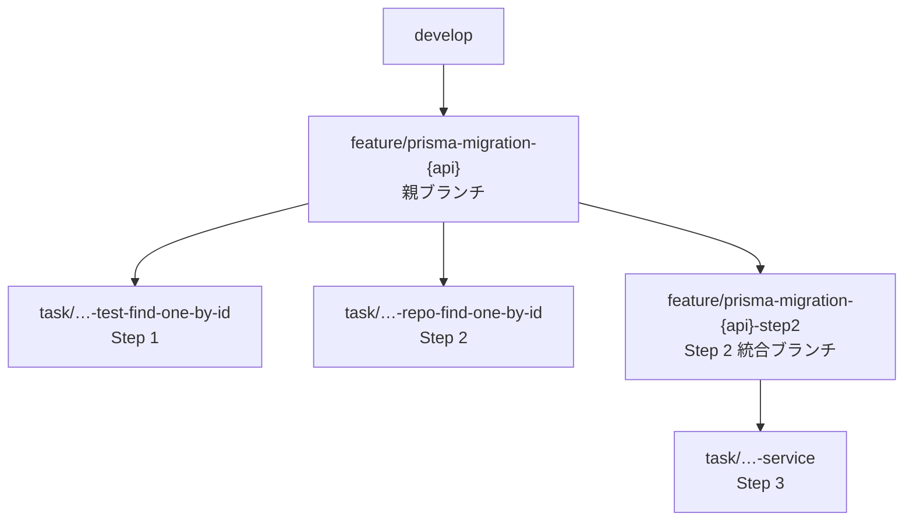

<!--
NestJS 製サーバーの ORM を TypeORM から Prisma へ段階的に移行しています。
今日話すのは「移行のやり方」ではなく「移行を任せられる形に設計した話」です。
-->

---
layout: define
kicker: 前提
term: 何をやっているか
definition: NestJS 製サーバーの ORM を、TypeORM から Prisma へ <span class="accent2">段階的に移行</span>中。
points:
  - Repository レイヤーを 1 メソッドずつ Prisma 化
  - 通常開発（develop）は止めない
  - 数十メソッド規模の単調な作業
---

<!--
規模感が大事です。数十メソッド。
人間が根性でやる量ではないし、一括置換で済むほど単純でもない。
-->

---
layout: panels
kicker: Part 1
title: なぜ「一気に書き換え」が<span class="accent2">できない</span>のか
panels:
  - icon: "lucide:git-branch"
    title: develop が動き続ける
    items:
      - 差分が指数関数的に増える
      - → API 単位でリリース
  - icon: "lucide:file-diff"
    title: 大きすぎる PR は通らない
    items:
      - 1 クラス分で +800 / −600 行
      - → 1 メソッド = 1 PR
  - icon: "lucide:shield-alert"
    title: 挙動を変えていない保証
    items:
      - "`findOne` は null か throw か"
      - → ハイブリッドテスト
---

<!--
3 つの制約があって、それぞれに対策があります。

1 つ目。移行は短期で終わらないのに通常開発は続くので、
大きな移行ブランチは develop との差分が指数関数的に増えてコンフリクト地獄になります。

2 つ目。+800/−600 行の PR を渡されると、どの Prisma メソッドが
どの TypeORM メソッドに対応するかをレビュアーが自力で復元しないといけない。
結果、形式的な Approve か後回しになります。

3 つ目。ORM を変えると「一見動いているが挙動が変わる」が起きます。

今日はこの右の 2 つ、1メソッド=1PR とハイブリッドテストを深掘りします。
-->

---
layout: compare
kicker: Part 2
title: 移行の 3 ステップと、その PR 粒度
columns: [ステップ, やること, PR 粒度]
rows:
  - { metric: Step 1, before: "TypeORM Repository のテストをハイブリッド Test 構成で作成", after: "1 メソッド = 1 PR" }
  - { metric: Step 2, before: "Prisma 版 Repository を作成し、テストの import 先を差し替え", after: "1 メソッド = 1 PR" }
  - { metric: Step 3, before: "Service の呼び出しを Prisma 版に切り替え", after: "1 Repository = 1 PR" }
---

<!--
Step 2 では Service を絶対に触りません。
find だけ Prisma 化すると戻り値の型が変わって Service が壊れるので、
各 PR が常に「ビルドが通る中間状態」であることを守っています。
-->

---
layout: define
kicker: Step 1 — 最大の工夫
term: ハイブリッドテスト
definition: 1 つのテストファイルに <span class="accent2">Prisma と TypeORM が同居</span>している状態。
points:
  - データの insert / delete は最初から Prisma で書く
  - 呼び出す Repository だけ TypeORM のまま
  - 目的は Step 2 の diff を最小化すること
---

<!--
一見ちぐはぐですが、これが次のステップで効いてきます。
-->

---
layout: code-explain
kicker: Step 2 の diff
title: 変わるのは、この <span class="accent2">2 箇所だけ</span>
notes:
  - "<strong>import 文</strong> — TypeORM Repository → Prisma Repository"
  - "<strong>インスタンス生成</strong> — dataSource → PrismaService"
  - "<strong>insert / truncate / factory / アサーションは 1 行も変わらない</strong>"
---

```diff
-import { setup, setupPrismaHelper } from "../../../db.helper";
-import { XxxRepository } from "../../../../repositories/typeorm/xxx.repository";
+import { PrismaService } from "../../../../prisma/prisma.service";
+import { setupPrismaHelper } from "../../../db.helper";
+import { XxxRepository } from "../../../../repositories/xxx.repository";

 describe("findOneById", () => {
-  const { dataSource } = setup();
-  const { insert, truncate } = setupPrismaHelper();
-  const repository = new XxxRepository(dataSource);
+  const { prisma, insert, truncate } = setupPrismaHelper();
+  const repository = new XxxRepository(prisma as unknown as PrismaService);
```

---
layout: statement
kicker: これが意味するところ
title: アサーションが変わっていないなら、<em>テスト観点も変わっていない</em>。
---

<!--
アサーションが変わっていないなら検証内容は変わっていない。
レビュアーは「Prisma 実装が TypeORM と同じ振る舞いか」だけに集中できます。
逆に diff でアサーションが書き換わっていたら、前提が崩れているサインです。
-->

---
layout: statement
kicker: Part 3 — AI に任せる
title: LLM は放っておくと「まず全メソッドのテストを書いて、あとで PR に分けよう」をやる。
---

<!--
そして分けられなくなります。
なので手順を Agent Skills として書き下すときに工夫が必要でした。
-->

---
layout: default
kicker: 工夫 1
title: workflow スキルの「<span class="accent2">絶対に守るルール</span>」
---

- 1 メソッド = 1 ブランチ = 1 PR。複数メソッドを 1 PR にまとめない
- **次のメソッドのファイルを触る前に、必ず前のメソッドの PR を作り切る**
- 各ブランチは毎回 `origin/{親ブランチ}` から切り直す
- Step 1 の全 PR がマージされるまで Step 2 に入らない

<Callout icon="lucide:layers-2">
スキルは 4 つに階層化。上位の workflow は**やり方を一切定義せず**、対象列挙・分割単位固定・順序制御・進捗管理だけを担う。
</Callout>

<!--
「何をするか」と「どの順序で・どの粒度でするか」を別ファイルに分けたのが効きました。
1 ファイルに全部書くと膨れ上がって、エージェントが細部を読み飛ばします。
-->

---
layout: diagram
kicker: 工夫 2
title: 親ブランチ + 統合ブランチで<span class="accent2">止めない</span>
highlight: [P, S2]
note: 各メソッドの PR は <strong>親ブランチ宛</strong>。develop のレビュー待ちに依存しない。
---



<!--
Step 3 は「全メソッドが Prisma 化済み」が前提ですが、Step 2 の全 PR のマージを待ちません。
Step 2 の全ブランチを merge した統合ブランチを自分で作って、その上で進めます。
実運用で一番効いた部分です。
-->

---
layout: statement
kicker: 結果
title: 移行作業ではなく「移行を進めてよいかの判断」だけが、人間の仕事になった。
---

<!--
人間に残るのは 2 つだけです。
1 つは検索系テストのレビュー。WHERE 句が 1 つ抜けても正常系は通るので、網羅性は人が見ます。
もう 1 つは「そもそもこれ、おかしくないか」の判断。
論理削除の挙動差は ESLint ルールで対応、外部キー制約は別タスクに切り出しました。
-->

---
layout: bigtype
kicker: 最大の学び
title: <em>レビュー可能な粒度</em>まで、分解する。
subtitle: そこまで分解できれば、AI は仕組みとして壊せない。そして人間にもレビューしやすい。
---

<!--
これを可能にしたのは AI の使い方の工夫ではなく、
移行手順をレビュー可能な粒度まで分解して、
システムとして「AI が壊せない形」に設計したことでした。

逆に言うと、これは人間が移行する場合にもそのまま有効な設計です。
「AI に任せられる手順」は「人間にとってもレビューしやすい手順」だった、
というのが一番の学びでした。
-->

---
layout: end
title: ありがとうございました
subtitle: 巨大なリファクタリングや ORM 移行に悩む方の参考になれば幸いです
contact: https://zenn.dev/asuene/articles/d0e395d49be271
---

<!--
アスエネでは、こうしたリファクタリングに限らず、
プロダクト開発やレビュープロセスでも AI をどんどん実戦投入して活用しています。
気になる方はぜひお気軽にお声がけください。
-->
