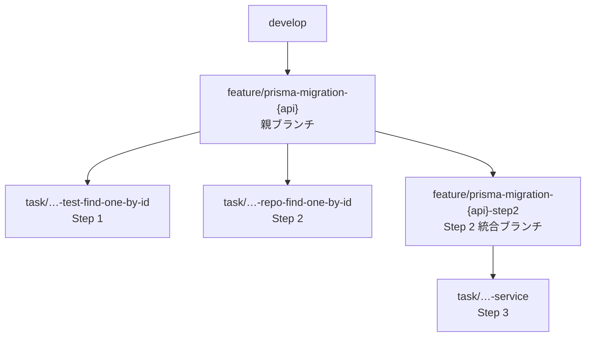

<!--
NestJS のサーバーの ORM を、TypeORM から Prisma に移行しています。
今日話すのは移行のやり方ではなく、それを任せられる形に設計した話です。
-->

---
layout: define
kicker: 前提
term: 何をやっているか
definition: NestJS 製サーバーの ORM を、TypeORM から Prisma へ <span class="accent2">全面的に移行</span>中。
points:
  - 対象は Repository レイヤー（Service より下）
  - 短期では終わらない規模
---

<!--
前提だけ共有させてください。
サーバーは NestJS、DB アクセスはほぼ TypeORM。これを Prisma に置き換えます。
触るのは Repository レイヤーだけ。ただ数が多くて、短期では終わりません。
-->

---
layout: statement
kicker: 素直にやるなら
title: Repository を全部書き換えて、まとめて 1 PR。<em>それが一番早い。</em>
---

<!--
やること自体は単純です。全部 Prisma で書き直して、1 つの PR を出せばいい。
できるならこれが一番早い。ただ、これができませんでした。
-->

---
layout: panels
kicker: Part 1
title: なぜ「一気に書き換え」が<span class="accent2">できない</span>のか
panels:
  - icon: "lucide:git-branch"
    title: developが動き続けている
    items:
      - 移行中もマージされ続ける
      - → API 単位でリリース
  - icon: "lucide:file-diff"
    title: 大きすぎるPRはレビューコストが高く、マージできない
    items:
      - 1 クラス分で +800 / −600 行
      - → 1 メソッド = 1 PR
  - icon: "lucide:shield-alert"
    title: 挙動を変えていないことを保証しなければならない
    items:
      - "`findOne` は null か throw か"
      - → ハイブリッドテスト
---

<!--
制約が 3 つあります。

1 つ目。移行中も develop へのマージは続くので、
大きなブランチを抱えたままだとコンフリクトを解消し続けることになります。

2 つ目。+800/−600 行の PR は、メソッドの対応関係をレビュアーが自力で復元することになる。
レビューコストが高すぎて、そのままではマージまで辿り着きません。

3 つ目。ORM を変えると「動いてはいるが挙動が違う」が起きます。
-->

---
layout: compare
kicker: Part 2
title: 移行の 3 ステップと、その PR 粒度
columns: [ステップ, やること, PR 粒度]
rows:
  - { metric: Step 1, before: "TypeORM Repository のテストをハイブリッド Test 構成で作成", after: "1 メソッド = 1 PR" }
  - { metric: Step 2, before: "Prisma 版 Repository を作成し、テストの import 先を差し替え", after: "1 メソッド = 1 PR" }
  - { metric: Step 3, before: "Service の呼び出しを Prisma 版に切り替え", after: "1 Repository = 1 PR" }
---

<!--
一気に書き換えられないので、3 つのステップに分けました。

Step1：既存のTypeORMのテストだけ書く、
Step2：PrismaでRepositoryのコードを書き、テストのimportをTypeORMからPrismaにを差し替える、
Step3：ServiceのimportをTypeORMからPrismaでRepositoryに切り替える。

基準は「どの PR をマージしてもビルドが通る」こと。
だから Step 2 では Service を触りません。
一部のメソッドだけ Prisma 化した状態で Service を向けると、型が合わず壊れるからです。
-->

---
layout: define
kicker: Step 1 — 最大の工夫
term: ハイブリッドテスト
definition: 1 つのテストファイルに <span class="accent2">Prisma と TypeORM が同居</span>している状態。
points:
  - データの insert / delete は最初から Prisma で書く
  - 呼び出す Repository だけ TypeORM のまま
  - 目的は Step 2 の diff を最小化すること
---

<!--
Step 1 で書くテストです。ここが一番の工夫です。

普通はテスト対象が TypeORM なので、データ準備も TypeORM で書きます。
でもここでは、データ準備だけ先に Prisma で書く。Repository は TypeORM のまま。

ちぐはぐですが、Step 2 の diff を最小化するためです。
-->

---
layout: code-explain
kicker: Step 2 の diff
title: 変わるのは、この <span class="accent2">2 箇所だけ</span>
notes:
  - "<strong>import 文</strong> — TypeORM Repository → Prisma Repository"
  - "<strong>インスタンス生成</strong> — dataSource → PrismaService"
  - "<strong>insert / truncate / factory / アサーションは 1 行も変わらない</strong>"
---

```diff
-import { setup, setupPrismaHelper } from "../../../db.helper";
-import { XxxRepository } from "../../../../repositories/typeorm/xxx.repository";
+import { PrismaService } from "../../../../prisma/prisma.service";
+import { setupPrismaHelper } from "../../../db.helper";
+import { XxxRepository } from "../../../../repositories/xxx.repository";

 describe("findOneById", () => {
-  const { dataSource } = setup();
-  const { insert, truncate } = setupPrismaHelper();
-  const repository = new XxxRepository(dataSource);
+  const { prisma, insert, truncate } = setupPrismaHelper();
+  const repository = new XxxRepository(prisma as unknown as PrismaService);
```

<!--
ここからが Step 2 です。今日一番見てほしい diff です。

変わっているのは import 文と、インスタンス生成だけ。
insert も truncate も、期待値のアサーションも 1 行も動いていません。
Step 1 でデータ準備を Prisma で書いておいたから、こうなります。
-->

---
layout: statement
kicker: これが意味するところ
title: アサーションが変わっていないなら、<em>テスト観点も変わっていない</em>。
---

<!--
テストが何を検証しているかは、アサーションに全部出ます。
それが動いていないなら、観点は変わっていないと diff だけで言い切れる。

レビュアーは「Prisma 実装が TypeORM と同じ振る舞いか」だけ見ればよくなります。
-->

---
layout: define
kicker: Step 3
term: 呼び出し元の差し替え
definition: Service が受け取る Repository を <span class="accent2">Prisma 版に差し替えるだけ</span>。
points:
  - Prisma 版 Repository は Step 2 で完成済み
  - Service のロジック自体は書き換えない
  - ここだけ 1 Repository = 1 PR
---

<!--
Step 3 です。Repository は Step 2 で完成しているので、
Service は受け取るものを差し替えるだけ。ここだけ 1 Repository = 1 PR です。

この 3 ステップを通しで回すワークフローが、次の話に繋がります。
-->

---
layout: statement
kicker: Part 3 — AI に任せる
title: LLM は放っておくと「まず全メソッドのテストを書いて、あとで PR に分けよう」をやる。
---

<!--
ここからが、AI に任せる話です。

手順が決まっているなら Skill に書いて渡すだけ、と思っていたんですが、
LLM はまず全メソッドのテストをまとめて書いて、あとで分けようとします。

そうなると、もう分けられません。Part 1 で一番避けたかった状態です。
-->

---
layout: default
kicker: 工夫 1
title: workflow スキルの「<span class="accent2">絶対に守るルール</span>」
---

- 1 メソッド = 1 ブランチ = 1 PR。複数メソッドを 1 PR にまとめない
- **次のメソッドのファイルを触る前に、必ず前のメソッドの PR を作り切る**
- 各ブランチは毎回 `origin/{親ブランチ}` から切り直す
- Step 1 の全 PR がマージされるまで Step 2 に入らない

<Callout icon="lucide:layers-2">
**Step 1〜3 を通しで回す統合 workflow** を頂点に、スキルは 4 つに階層化。上位の workflow は**やり方を一切定義せず**、対象列挙・分割単位固定・順序制御・進捗管理だけを担う。
</Callout>

<!--
それをどう封じたかです。

効いているのは 2 つ目のルール。
「次のメソッドを触る前に、前のメソッドの PR を作り切る」。
後から分けるのではなく、分けないと次に進めない形にしました。

もう一つがスキルの構成です。
頂点に、Step 1 から 3 までを通しで回す統合 workflow を置いています。
ここには「やり方」を書かず、順序と粒度と進捗だけ。
短いので、エージェントが毎回そこに立ち返れます。
-->

---
layout: diagram
kicker: 工夫 2
title: 親ブランチ + 統合ブランチで<span class="accent2">止めない</span>
highlight: [P, S2]
note: 各メソッドの PR は <strong>親ブランチ宛</strong>。develop のレビュー待ちに依存しない。
---



<!--
Step 3 は全メソッドの Prisma 化が前提ですが、マージは待ちません。
Step 2 の全ブランチを merge した統合ブランチを自分で作って進めます。
実運用で一番効いた部分です。

この親ブランチが API 単位なのが、Part 1 の 1 つ目(developが常に動き続けている問題への)への対策です。
-->

---
layout: statement
kicker: 結果
title: 移行作業ではなく「移行を進めてよいかの判断」だけが、人間の仕事になった。
---

<!--
結果として、人間に残るのは 2 つだけです。
検索系テストのレビューと、「そもそもこれ、おかしくないか」の判断。
WHERE 句が 1 つ抜けても正常系は通るので、網羅性は人が見ます。
-->

---
layout: bigtype
kicker: 最大の学び
title: <em>レビュー可能な粒度</em>まで、分解する。
subtitle: そこまで分解できれば、AI は仕組みとして壊せない。そして人間にもレビューしやすい。
---

<!--
AI を活用するために必要だったのは、プロンプトの工夫ではなく、
手順を抽象化して、レビュー可能な粒度まで分解することでした。

AI に任せられる手順は、人間にもレビューしやすい手順だった。これが一番の学びです。
-->

---
layout: end
title: ありがとうございました
subtitle: 巨大なリファクタリングや ORM 移行に悩む方の参考になれば幸いです
contact: https://zenn.dev/asuene/articles/d0e395d49be271
---

<!--
アスエネでは、プロダクト開発やレビュープロセスでも AI をどんどん実戦投入しています。
気になる方はぜひお気軽にお声がけください。
-->
